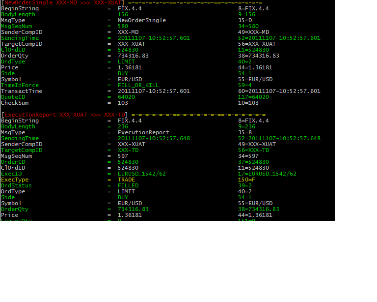

# FixProtocolTools

Provides fixless command which shows fix protocol log in human readable way.

Inspired by http://code.nomad-labs.com/fix-message-viewer/

## Key features

* coloring
* grep by enum values with marked result
* include own fix dictionary
* highligh fields
* hide/show heartbeats

## Examples

### Fix log as is:

    20111107-10:52:22.133: 8=FIX.4.49=10035=A34=149=XXX-MD52=20111107-10:52:22.12856=XXX-XUAT98=0108=30141=Y553=XXXmd554=XXXmd110=146
    20111107-10:52:25.272: 8=FIX.4.49=7735=A52=20111107-10:52:25.92649=XXX-XUAT56=XXX-MD34=1141=Y108=3098=010=176
    20111107-10:52:25.273: 8=FIX.4.49=7235=h52=20111107-10:52:25.92749=XXX-XUAT56=XXX-MD34=2336=MD340=210=000
    20111107-10:52:54.373: 8=FIX.4.49=13035=V34=349=XXX-MD52=20111107-10:52:54.37356=XXX-XUAT262=EURUSD:0:0001263=1264=0265=0146=155=EUR/USD267=2269=0269=110=192
    20111107-10:52:54.374: 8=FIX.4.49=13035=V34=449=XXX-MD52=20111107-10:52:54.37456=XXX-XUAT262=GBPUSD:0:0002263=1264=0265=0146=155=GBP/USD267=2269=0269=110=157
    20111107-10:52:54.688: 8=FIX.4.49=17335=W52=20111107-10:52:58.25549=XXX-XUAT56=XXX-MD34=6262=GBPUSD:0:000255=GBP/USD268=2269=0270=1.6006271=1000000299=28019269=1270=1.60082271=1000000299=2802010=207

### Viewed by fixlgviewer:

$ fixlogviewer somefixfile

           =-=-=-=-=-=-==-=-=-=-=-=-==-=-=-=-=-=-=
    BeginString                    =  FIX.4.4                               8  =  FIX.4.4
    BodyLength                     =  100                                   9  =  100
    MsgType                        =  Logon                               35  =  A
    MsgSeqNum                      =  1                                   34  =  1
    SenderCompID                   =  XXX-MD                              49  =  XXX-MD
    SendingTime                    =  20111107-10:52:22.128               52  =  20111107-10:52:22.128
    TargetCompID                   =  XXX-XUAT                            56  =  XXX-XUAT
    EncryptMethod                  =  NONE_OTHER                          98  =  0
    HeartBtInt                     =  30                                 108  =  30
    ResetSeqNumFlag                =  Y                                  141  =  Y
    Username                       =  XXXmd                              553  =  XXXmd
    Password                       =  XXXmd1                             554  =  XXXmd1
    CheckSum                       =  146                                 10  =  146
            =-=-=-=-=-=-==-=-=-=-=-=-==-=-=-=-=-=-=

### With color output

## Installation

    $ gem install fix_protocol_tools

## Usage

Usage: fixlogviewer \[options\] \[file\]

        --dictionary PATH            You can set up FPT_DICT env variable instead
        --highlight field1,field2    Highlight number of fields, you can set FPT_HIGHLIGHTS env variable instead
    -c, --[no-]color                 Generate color output
        --grep                       Grep by field id or name
        --[no-]heartbeats            Show full report on heartbeat messages
    -h, --help                       Display help message
    -v, --version                    Display version message

